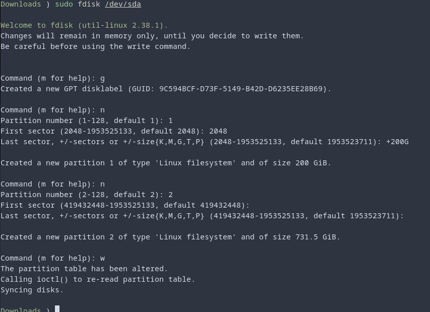
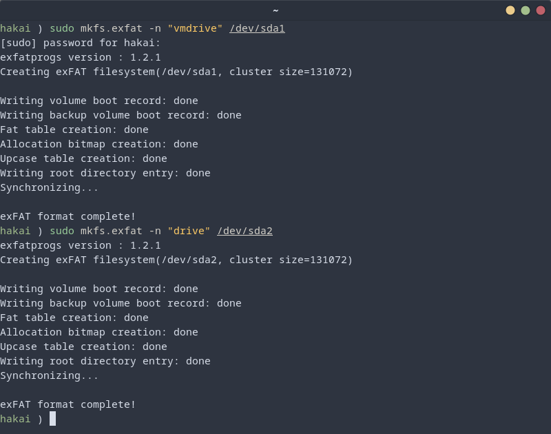

# Formatting & Mounting Storage Volumes


## Listing and Identifying Storage Devices
let's begin by learning how to list and identify the storage devices attached to your system. Using the lsblk command, you can get a comprehensive list of all the block devices, such as hard drives and USB flash drives, connected to your machine.

```bash
lsblk
```
Each storage device is uniquely identified by a device name like sda, sdb, etc., which will help you interact with them.

## Creating a Partition Table and Partitions with fdisk

`fdisk` is a powerful command-line tool that allows you to create and manage partition tables on your storage devices. In this section, it'll walk you through the process of creating a partition table, creating partitions, and writing the changes to the disk.

> ### Be cautious when using fdisk as it directly modifies the disk's partition table. Any incorrect actions may lead to data loss. Make sure you have a backup of your important data before proceeding.

Identify the Disk Device
Before using fdisk, you need to identify the disk device you want to partition. To list all available disks, use the lsblk command:

```bash
lsblk
```
Identify the disk you want to partition, such as /dev/sdX (e.g., /dev/sda, /dev/sdb, etc.), where "X" is the specific letter assigned to the disk by the system.

## Launching fdisk
To start partitioning the disk, run fdisk with the chosen disk device:

```bash
sudo fdisk /dev/sdX
```
Replace `/dev/sdX` with the appropriate disk identifier.

### Creating a New Partition Table
If the disk is not yet partitioned or you want to create a new partition table, follow these steps:
a. Press `g` to create a new GPT (GUID Partition Table) or `m` to create a new MSDOS (MBR) partition table.

### Creating Partitions
To create a new partition, follow these steps:

- Press n to start creating a new partition.
- Specify the partition number (e.g., 1, 2, etc.).
- Specify the starting sector (press Enter for the default).
- Specify the ending sector. You can either:
- Use a specific size (e.g., +1G for 1 gigabyte) or
- Press Enter to use the remaining space on the disk.



## Formatting a Storage Device

After creating partitions, you'll typically need to format them with a file system before using them. Once you've identified the storage device you want to utilize, you might need to format it with a specific file system type before you can use it. For Linux, the most common file system types are ext4, while for cross-platform compatibility with Windows, you can use exFAT. Here are the commands to format the partition:

```bash     
sudo mkfs.ext4 /dev/<device_partition>
```
or
```bash
sudo mkfs.exfat -n "label" /dev/<device_partition>
```
Replace <device_partition> with the appropriate partition identifier, such as /dev/sdb1, for your device.



## Mounting the Storage Volume
After formatting the partition, you can mount it to make it accessible within the file system. You have the flexibility to mount the partition to any folder you like, but commonly used mount points are /mnt for permanent volumes and /media for temporary ones.

Here's how you can mount the partition:

```bash
sudo mount /dev/<device_partition> /<mount_path>
```
Here, we can see each option can be supplied along with a value when mounting the device. 
```bash
sudo mount -o uid=<uid>,gid=<group_id> /dev/<device_partition> /<mount_path>
```
Replace <mount_path> with the directory where you want to access the storage volume.

## Analyzing Disk Usage with ncdu
Now, let's introduce you to a powerful storage management tool called ncdu. In case it's not already installed, you might need to install it first. For Fedora and Centos use:

```bash
sudo dnf install ncdu
```
For Debian-based systems, use apt instead of dnf.

Once installed, you can use ncdu to analyze disk usage on your system. This tool provides a detailed breakdown of files and directories consuming the most space. To use ncdu, simply run:

```bash
sudo ncdu
```
It will display the disk usage starting from your current directory. You can navigate through the results, drill down into directories, and identify which files are taking up the most space. This tool is incredibly handy when you need to reclaim storage space on your system.

## Automating Mounts with /etc/fstab
For those looking to automate the process of mounting storage volumes during system boot, the /etc/fstab file comes to the rescue. However, editing this file requires caution, as mistakes can prevent your system from booting correctly.

The /etc/fstab file allows you to specify the devices and mount points you want to mount automatically at startup, using UUIDs or device names to identify the storage volumes. Please note that editing this file requires an understanding of the correct syntax and should be approached carefully. If you're unsure, it's best to seek expert guidance or create proper backups before making any changes.