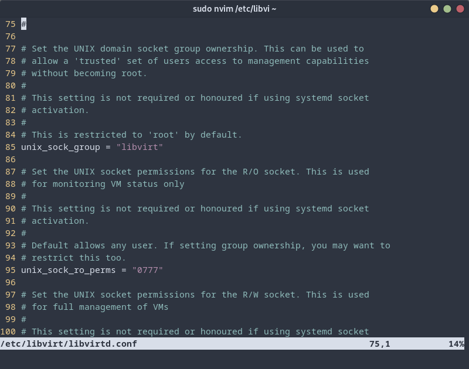

# Virtualization Using Virt-manager

Virtualization is a revolutionary technology that allows users to experiment with various operating systems and applications without the fear of damaging their primary system. In this blog, we will explore the power of virtual machines, understand the role of hypervisors, and delve into the dynamic duo of QEMU and KVM. We will also learn how to get started with virtualization on Linux, including installing necessary packages and configuring the libvirt system. Let's embark on an exciting journey of virtualization and unleash the full potential of your Linux experience!

## The Power of Virtual Machines

Virtual machines open up a whole new world of possibilities for Linux users. They enable you to test non-Linux compatible programs, experiment with various configurations, and even play games, all within a secure and isolated environment. With the ability to take snapshots, you can easily restore virtual machines to previous states if needed. Virtualization provides an extra layer of security, as any infection or virus within the virtual machine won't harm the host system. So, you can explore, experiment, and learn without the fear of damaging your primary system.

## Understanding Hypervisors

Before we dive into virtualization on Linux, let's familiarize ourselves with hypervisors, the backbone of virtualization. Hypervisors are small programs that efficiently distribute your computer's CPU cores, RAM, and storage resources. There are two main types of hypervisors: type 1 (bare metal) and type 2. Type 1 hypervisors, like VMware and Hyper-V, run directly on your hardware, optimizing resource management for guest operating systems. Type 2 hypervisors, like VirtualBox and QEMU, run on top of the host operating system, adding a resource management layer. For non-production environments, the performance difference between the two is negligible.

## QEMU and KVM 

In the realm of virtualization on Linux, you'll often encounter two terms: QEMU and KVM. QEMU is a quick emulator similar to VirtualBox, capable of creating virtual drives and powering virtual machines on and off. It can also integrate peripherals like a mouse or keyboard through its dedicated driver. On the other hand, KVM (Kernel-based Virtual Machine) is an integral part of the Linux kernel. It transforms the Linux kernel into a type 1 hypervisor, directly managing hardware for virtual machines. The unique feature of KVM is its ability to act as a hardware acceleration method for virtual machines, providing high-speed performance similar to GPU acceleration for virtual environments.

## Virtualization on Linux - Getting Started

To embark on your virtualization journey on Linux, ensure that your CPU supports virtualization. Head into your computer's UEFI settings, locate and enable "Intel Virtualization Technology" for Intel CPUs or "svm mode" for AMD CPUs. Once that's done, let's explore the two popular methods for virtualization on Linux.For a user-friendly and straightforward virtualization experience, Gnome Boxes is an excellent choice. It utilizes QEMU and is KVM-compatible, ensuring good performance for most use cases. The interface is intuitive, allowing you to select an operating system from a provided list or use your own ISO file. Setting up the VM is a breeze; just define the RAM and disk space, and you're ready to install your desired operating system. Gnome Boxes even supports 3D acceleration for smooth performance.

## Virtual Machine Manager - For More Control

For those seeking greater control over virtualization on Linux, Virtual Machine Manager (virt-manager) is the way to go. This open-source solution offers an advanced user interface with customizable options. You can select your own ISO file, customize the RAM, CPU cores, and virtual disk size. Virt-manager allows you to pass through devices directly to the VM, perfect for configuring peripherals or enhancing gaming performance.

## Optimizing Virtual Machines

When installing operating systems like Windows 11, ensure your virtual machine has the necessary settings, such as Secure Boot and TPM 2.0 support. If you encounter issues with 3D acceleration, check the display and video settings for proper configuration. For Windows 11 installations, you may need to modify the XML configuration for compatibility.

## Explore and Experiment

With your virtual machines up and running, the possibilities are endless. You can experiment with various operating systems, applications, and configurations without affecting your host system. Virtualization on Linux is a powerful tool for developers, testers, and enthusiasts alike.

## Installation and Configuration on Fedora 

If you're using Fedora Workstation, installing and configuring virtualization is a breeze. We'll walk you through the process step by step. Firstly, install the necessary packages using the package manager:

```bash
sudo dnf install @virtualization
```
Next, edit the libvirtd configuration file to enable regular users to administer libvirt:

```bash 
sudo nvim /etc/libvirt/libvirtd.conf
```
Adjust the domain socket group ownership to `libvirt` and the UNIX socket permissions to `0770`



Finally, start and enable the libvirtd service:

```bash
sudo systemctl start libvirtd
sudo systemctl enable libvirtd
```
To administer libvirt with your regular user account, add your user to the libvirt group:
```bash
sudo usermod -a -G libvirt $(whoami)
```
## Getting Started with virt-manager

Now that we have virtualization set up on Fedora Workstation, let's explore the user-friendly graphical interface provided by virt-manager. To start virt-manager, simply search for "Virtual Machine Manager" or "virt-manager" and launch the application.

Virt-manager displays a list of connections, including the local system connection. From here, you can manage virtual networks and storage definitions.

## Creating Your First Virtual Machine

Let's create your very first virtual machine using virt-manager:

- Click the "Create a new virtual machine" button on the main form.
- Choose the installation mode: local installation media, network boot/installation, or import an existing virtual disk.
- Provide the ISO image path if you selected local installation media.
- Size the CPU, memory, and disk for the virtual machine.
- Choose network preferences: default network (NAT) for isolation or bridged network for external accessibility.
- Customize configuration before install (optional): Review or change the configuration before starting the setup.
- Begin installation: Start the OS installation in the virtual machine.
- Once the installation is complete, your virtual machine will appear in the list on the main form. From here, you can access and manage the virtual machine with ease.

## Conclusion:

Virtualization on Linux offers a world of opportunities for exploring, experimenting, and learning without the fear of damaging your primary system. Whether you choose the simplicity of Gnome Boxes or the control of Virtual Machine Manager, virtual machines on Linux provide unmatched flexibility and security. With the power of QEMU, KVM, and libvirt, you can unleash the full potential of your Linux experience. So go ahead, start virtualizing, and immerse yourself in this exciting technology! Happy virtualization!